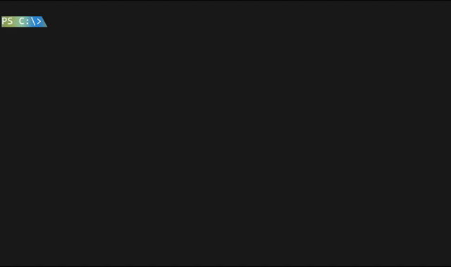

<div align="center">

# 🌿 Minty

**A GPU-accelerated terminal emulator**



<sub>Demo recorded from <a href="../../tree/core/adding-color-support-cellbuffer"><code>core/adding-color-support-cellbuffer</code></a> — not representative of the current main branch</sub>

</div>

---

Minty is a terminal emulator built from scratch with a focus on GPU-accelerated rendering via OpenGL. It is currently a work in progress and not yet ready for daily use.

## Features

- **GPU Rendering** — text and UI are rendered entirely on the GPU via OpenGL, bypassing traditional GDI/software rendering
- **VT/ANSI Support** — ~90% VT/ANSI escape sequence support including SGR color handling *(not yet stable)*

## Platform

| Platform | Status              |
| -------- | ------------------- |
| Windows  | ✅ Builds and runs   |
| Linux    | ❌ Not supported yet |
| macOS    | ❌ Not supported yet |

## Building

### Prerequisites

- [Ninja](https://ninja-build.org/)
- [LLVM/clang-cl](https://llvm.org/)
- [CMake](https://cmake.org/) 3.20+
- PowerShell (for setup script)

### Steps

> **Note:** The demo above is from the `core/adding-color-support-cellbuffer` branch.
> To build that version, check it out first:
> 
> ```powershell
> git checkout core/adding-color-support-cellbuffer
> ```
> 
> Otherwise, continue below to build from `main`.

**1. Install dependencies via vcpkg**

```powershell
.\setup-vcpkg.ps1
```

**2. Configure**

```bash
cmake --preset default-windows
```

**3. Build**

```bash
cmake --build --preset default-windows
```

**4. Run**

```base
.\build\default\src\minty.exe
```

## Configuration

### Animated Prompt (Windows)

For the animated prompt to work, add the following to your PowerShell profile (`$PROFILE`):

```powershell
function prompt {
    $oscStart = "`e]133;A`a"
    $oscEnd = "`e]133;B`a"
    $path = $(Get-Location)
    return "${oscStart}PS $path> $oscEnd"
}
```

To open your PowerShell profile for editing:

```powershell
notepad $PROFILE
```

## Status

Minty is in early development. The codebase is actively evolving and no stable API or release is guaranteed at this stage. Contributions are not open yet — this is currently a personal showcase project.

## License

MIT - see [LICENSE](LICENSE) for details.
